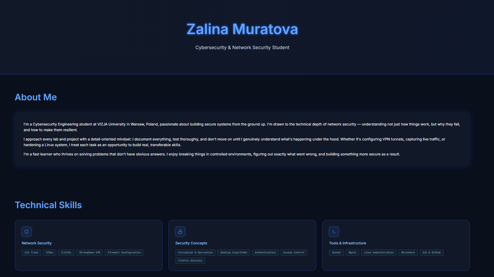
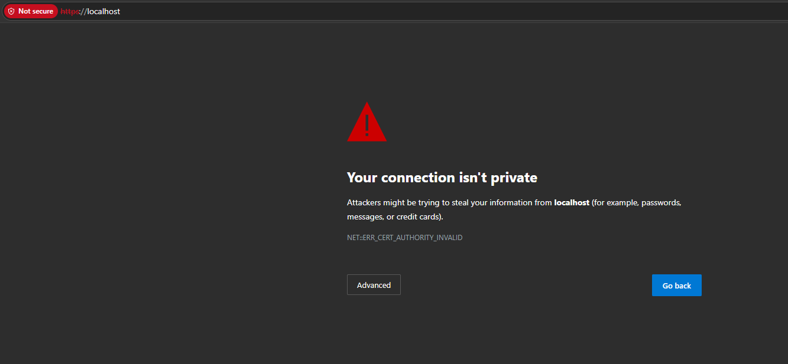
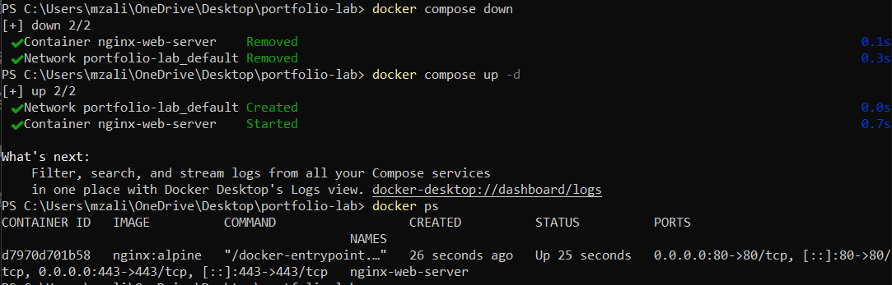
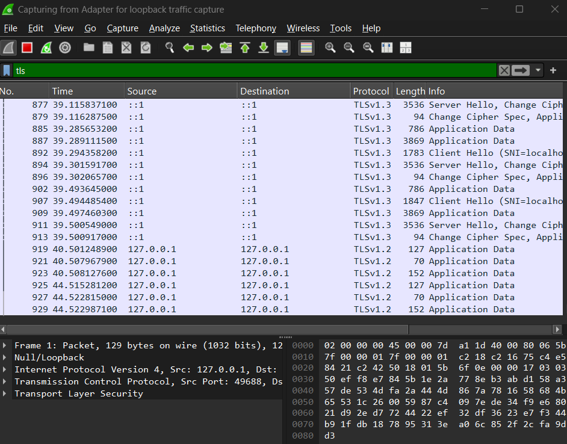

# Dockerized Nginx TLS Portfolio

## Overview

This project demonstrates the deployment of a cybersecurity portfolio website using Docker and Nginx with HTTPS/TLS encryption.

The project includes:
- Docker containerization
- Nginx web server configuration
- TLS/SSL implementation
- Self-signed certificates
- HTTPS traffic analysis using Wireshark

---

## Technologies Used

- Docker
- Nginx
- TLS/SSL
- Wireshark
- HTML/CSS
- Ubuntu/Linux

---

## Key Features

- HTTPS-enabled web server
- Self-signed TLS certificate
- Dockerized deployment
- Nginx reverse proxy configuration
- TLS handshake analysis
- Secure encrypted communication

---

## Screenshots

### Portfolio Website

### TLS Browser Warning

### Docker Container Running

### Wireshark TLS Analysis

---

## Files Included

- docker-compose.yml
- nginx.conf
- index.html
- TLS traffic screenshots

---

## Learning Outcomes

This project provided practical experience with:

- Docker containerization
- Nginx server configuration
- TLS/SSL implementation
- HTTPS deployment
- Wireshark TLS analysis
- Secure web infrastructure

---

## Author

Zalina Muratova
Cybersecurity & Network Security Student
